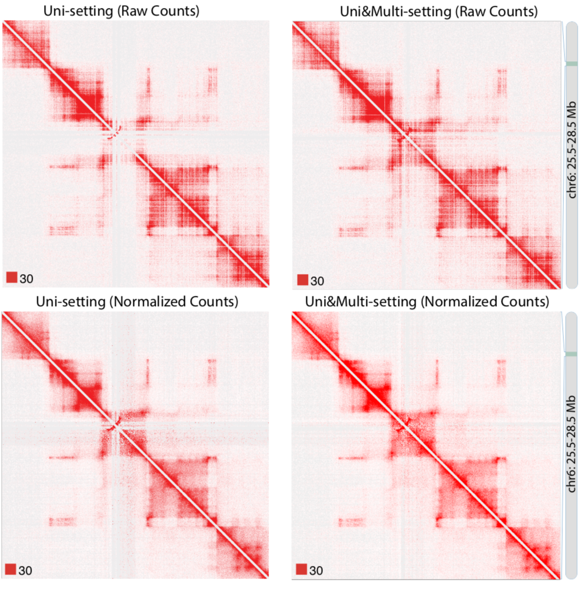
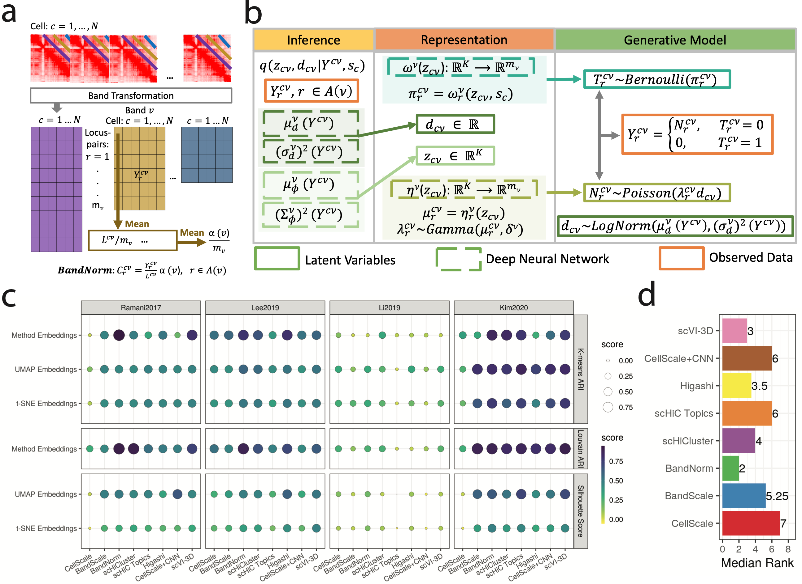
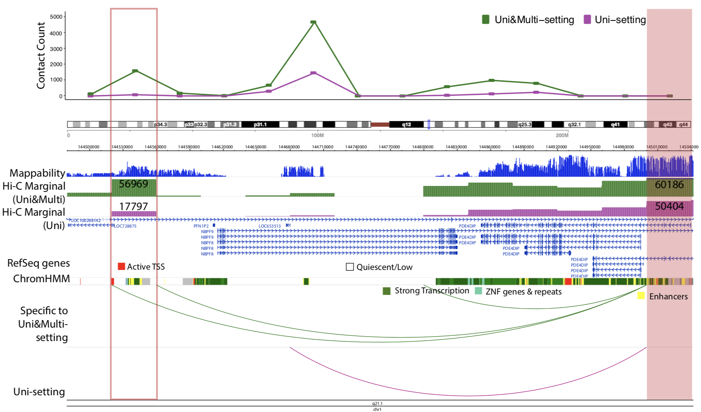

**Overview**: Our project focuses on developing statistical methods and computational tools for analyzing three-dimensional genome structure data. With the emergence of Hi-C and other 3C-derived technologies, we can now investigate chromatin interactions at unprecedented resolution, from megabase to kilobase scales. Our research addresses key challenges in processing and analyzing these complex datasets through innovative statistical approaches and efficient computational implementations.

**Motivation**: The three-dimensional organization of chromatin plays a crucial role in gene regulation and disease development. Our research addresses several fundamental challenges in 3D genomics through multiple innovative approaches:

1. **mHi-C**: A probabilistic framework for utilizing multi-mapping reads in Hi-C data analysis
   - Recovers ~20% additional sequencing depth typically discarded
   - Refines chromatin domain boundaries
   - Identifies novel promoter-enhancer interactions

2. **FreeHi-C & FreeHi-C SpikeIn**: Empirical simulation tools for Hi-C data
   - Generates realistic Hi-C contact matrices
   - Enables power analysis and method development
   - Provides user-controlled noise levels

3. **BandNorm & scVI-3D**: Advanced tools for single-cell Hi-C analysis
   - Addresses technical biases in scHi-C data
   - Enables robust cell-type identification
   - Facilitates rare cell type analysis

We collaborate with multiple research groups, combining expertise in statistics, computational biology, and genomics. Our tools have been widely adopted by the 3D genomics community and have contributed to numerous studies investigating gene regulation mechanisms and disease-associated genetic variants.

The project's success has led to improved understanding of:
- Long-range gene regulation mechanisms
- Disease-associated genetic variants
- Chromatin domain structure in cancer
- Cell-type specific genome organization

Our long-term goal is to continue developing robust computational methods that advance our understanding of 3D genome organization and its role in human disease.

