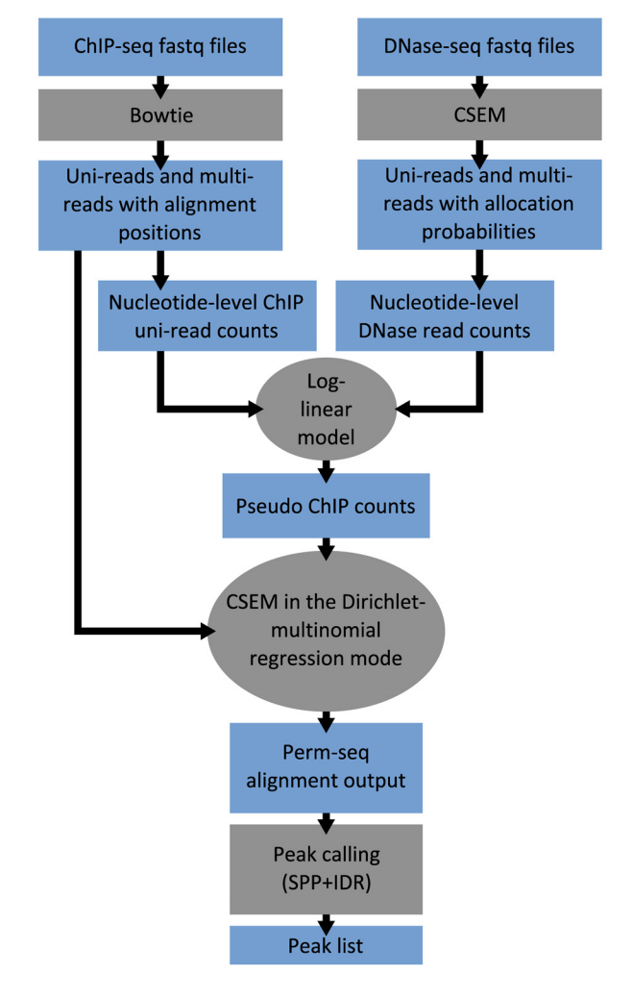
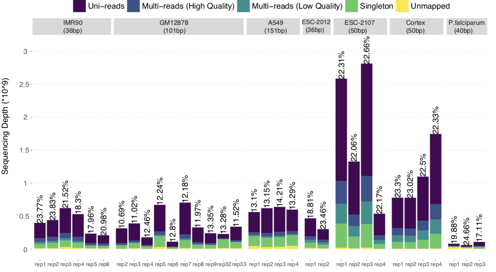

**Overview**: Our project focuses on developing computational methods for analyzing repetitive DNA regions, which have been historically challenging to study due to their multiple occurrences across the genome. These regions, comprising nearly half of the human genome, are increasingly recognized as crucial elements in genome organization and disease development.

**Motivation**: Repetitive DNA sequences, appearing multiple times across the genome, are abundant in species ranging from bacteria to mammals. While their role remained speculative for decades, recent studies have demonstrated their vital importance in stabilizing genome contacts and their involvement in various genetic disorders.

Our research in repetitive DNA analysis has evolved through several key developments:

1. **Permseq Development**:
   - An R package developed during the ENCODE III project
   - Enables mapping of protein-DNA interactions in highly repetitive regions
   - Utilizes prior-enhanced read mapping approach
   - Addresses false positives and negatives in repetitive region analysis

2. **mHi-C Application**:
   - Specialized tool for handling multi-mapping reads in 3D nucleosome studies
   - Significantly improves sequencing depth utilization
   - Enables refined inference of genome structure
   - Provides better understanding of repetitive region functions

3. **Key Research Findings**:
   - Demonstrated co-localization of short tandem repeats with chromatin domain boundaries
   - Identified connections to inherited human disorders
   - Revealed role of repetitive DNA in genome organization
   - Improved understanding of disease mechanisms

The significance of our work includes:
- Better analysis of regions linked to over 25 inherited human disorders
- Improved understanding of conditions like fragile X syndrome and Huntington's disease
- Enhanced mapping of protein-DNA interactions in repetitive regions
- More accurate genome structure analysis

Our ongoing research continues to develop new methods for understanding the complex roles of repetitive DNA in genome organization and disease development.
